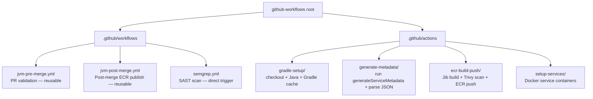

# CLAUDE.md — github-workflows

## Section 1 — Local Setup, Build & Startup

This repository contains no application code and has no build system. It is a library of reusable GitHub Actions workflows and composite actions consumed by other repositories via `uses: jupitermoney/github-workflows/...@main`. There is no local build, test, or startup command.

The only workflow that runs directly inside this repository is `semgrep.yml`, which triggers on pull requests to `main`/`master`/`develop` and on a weekly schedule. All other workflows (`jvm-pre-merge.yml`, `jvm-post-merge.yml`) are `workflow_call`-triggered and run inside consumer repositories.

To validate a change to a reusable workflow or composite action, create a test PR in a consumer repository that calls the updated workflow from the branch under review.

---

## Section 2 — Module Topology & Architecture

This repository has no sibling module dependencies within a larger monorepo. It is a standalone repository.

---

## Section 3 — Integrations & Network Topology

### A. Core Infrastructure

| System | Protocol | Role |
|---|---|---|
| GitHub Actions runtime | GitHub-hosted runner (`ubuntu-latest`) | Executes all workflow jobs |
| GitHub Actions Cache | GitHub Cache API | Stores and restores `~/.gradle/caches` and `~/.gradle/wrapper` keyed on `gradle-<OS>-<hash of *.gradle.kts and gradle-wrapper.properties>` |
| AWS ECR (`ap-south-1`) | HTTPS / Docker registry | Target registry for all Jib image pushes; login uses AWS credentials injected per-job |

### B. Downstream Services — APIs We Consume

#### AWS ECR — Docker Registry

Stores built container images. The `ecr-build-push` composite action authenticates, pushes, and then logs out from `454518750364.dkr.ecr.ap-south-1.amazonaws.com`.

> Integration: `.github/actions/ecr-build-push/action.yml`

#### Trivy / Approval Service — Security Scanning

Container image vulnerability scanning. Each image is submitted to an approval service endpoint before the Docker push step proceeds.

> Integration: `.github/actions/ecr-build-push/action.yml` (calls `jupitermoney/security-automations@main` with `tool: trivy`)

#### SonarQube — Static Analysis

Code quality analysis invoked via `./gradlew sonar` in consumer repositories. The `sonar_enabled` flag is read from `build/metadata/service-metadata.json` produced by `generateServiceMetadata`. The actual `sonar` Gradle invocation is currently commented out in both reusable workflows.

> Integration: `.github/workflows/jvm-pre-merge.yml`, `.github/workflows/jvm-post-merge.yml`

#### Semgrep — SAST Scanning

Static application security testing delegated to an external reusable workflow. Runs on PRs to this repository and on a weekly schedule.

> Integration: `.github/workflows/semgrep.yml` (calls `jupitermoney/security-automations/.github/workflows/semgrep-reusable-workflow.yml@develop`)

#### Artifactory — Gradle Dependency Proxy

Gradle dependency resolution proxy. Credentials are injected as `ARTIFACTORY_USER` / `ARTIFACTORY_PASSWORD` environment variables consumed by the Gradle build in consumer repositories.

> Integration: `.github/workflows/jvm-pre-merge.yml`, `.github/workflows/jvm-post-merge.yml` (environment variable injection)

### C. Exposed Interfaces — APIs We Provide

#### jvm-pre-merge.yml (`workflow_call`)

Reusable PR validation workflow for JVM services. Accepts inputs to configure Java version, optional service containers, and optional PR image publish to staging ECR.

> Spec: `.github/workflows/jvm-pre-merge.yml`

| Path | Description |
|---|---|
| N/A — GitHub Actions workflow, no HTTP observability endpoints | — |

#### jvm-post-merge.yml (`workflow_call`)

Reusable post-merge workflow that tests, builds Jib images per module (via matrix), runs Trivy, and pushes `rc-<sha>` or `hotfix-<sha>` tags to ECR.

> Spec: `.github/workflows/jvm-post-merge.yml`

| Path | Description |
|---|---|
| N/A — GitHub Actions workflow, no HTTP observability endpoints | — |

---

## Section 4 — Important Files Reference

| File Path | Category | Purpose |
|---|---|---|
| `.github/workflows/jvm-pre-merge.yml` | spec | Reusable `workflow_call` workflow for PR validation of JVM services; defines all accepted inputs and secrets |
| `.github/workflows/jvm-post-merge.yml` | spec | Reusable `workflow_call` workflow for post-merge image build and ECR publish |
| `.github/workflows/semgrep.yml` | spec | Direct-trigger SAST workflow for this repository; delegates to an external reusable Semgrep workflow |
| `.github/actions/gradle-setup/action.yml` | spec | Composite action: checkout, Java setup, Gradle cache restore |
| `.github/actions/generate-metadata/action.yml` | spec | Composite action: runs `generateServiceMetadata` Gradle task and parses `build/metadata/service-metadata.json` into `matrix` and `sonar_enabled` outputs |
| `.github/actions/ecr-build-push/action.yml` | spec | Composite action: computes Docker tag, runs Jib build, runs Trivy scan, pushes image to ECR |
| `.github/actions/setup-services/action.yml` | spec | Composite action: starts Docker containers for `postgres` (17-alpine), `mysql` (8.0), or `minio` (latest) based on comma-separated `services` input |
| `README.md` | config | Repository-level overview and links to all sub-READMEs and integration guides |
| `.github/workflows/README.md` | config | Workflow catalog, consumer usage examples, update checklist, breaking-change guidance |
| `.github/actions/README.md` | config | Composite actions catalog, update checklist, breaking-change guidance |
| `.github/workflows/JAVA_APP_ECR_PUBLISH_README.md` | config | Consumer integration guide: inputs, secrets contract, metadata contract, image tag format, troubleshooting |

---

## Section 5 — Maintenance

| Field | Value |
|---|---|
| Last Updated | 2026-05-19 |
| Project Version | N/A — no versioned build artifact |
| Maintained By | Unknown |
